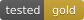

# Contributing to Awesome Well-Tested

Thank you for helping us curate repositories with outstanding test quality.

## Submission Requirements

### What qualifies?

A repository must meet **all** of the following baseline criteria:

- Open source with a recognized license
- Actively maintained (commit activity within the last 12 months)
- Has a CI pipeline that runs tests automatically
- Line or branch coverage >= 80%, verifiable via badge, report, or CI output

### Tier Assignment

| Tier | Additional requirements beyond baseline |
|------|----------------------------------------|
| **Bronze** | Baseline only: coverage >= 80% with CI reporting |
| **Silver** | Mutation testing tool configured and integrated into build |
| **Gold** | Mutation testing with a verified mutation score >= 70% |

Parameterized and property-based tests are detected and shown in their own
column, but they do not change the tier. They are recorded because coverage
cannot express them: a function exercised across many inputs is tested harder
than one exercised once.

### What does NOT qualify?

- Toy projects, demo repos, or tutorial code
- Repos where high coverage comes from trivial or auto-generated tests
- Repos with coverage badges that link to broken or outdated reports
- Forks (submit the upstream instead)

## How to Submit

### 1. Verify the repo

Run the verification script:

```bash
python scripts/verify_repo.py https://github.com/owner/repo
```

This checks:
- CI configuration (GitHub Actions, Jenkins, Travis, GitLab CI)
- Coverage tool configuration (JaCoCo, pytest-cov, Istanbul, etc.)
- Mutation testing configuration (PIT, mutmut, Stryker, etc.)
- Coverage badges and linked reports

The script generates a JSON report in `reports/`.

### 2. Add the entry

Add a row to the appropriate language table in `README.md`:

```markdown
| [repo-name](https://github.com/owner/repo) |  | 94% | 78% | JaCoCo | PIT |
```

### 3. Submit a Pull Request

- Title: `Add owner/repo (Language, Tier)`
- Include the verification report output
- One repo per PR (unless submitting a batch of related repos)

## Verifying through GitHub Actions

You do not need a token of your own. The `verify` workflow runs the same script
with the token GitHub Actions provides automatically, which lifts the API limit
from 60 to 1000 requests per hour.

- **Actions -> verify -> Run workflow**, then put the repositories in the
  `repos` field, space separated (`owner/repo owner/other-repo`). Leave it empty
  to recheck everything already on the list.
- The run summary shows the tier and the reason for it.
- Refreshed reports come back as a pull request, so nothing is written to the
  default branch without review.

The workflow also runs weekly and fails when a listed entry no longer holds its
tier, which is how the list stays honest.

Discovering new candidates uses `scripts/discover_candidates.py` and the
`discover` workflow. GitHub's code search endpoint is stricter than the rest of
the API and may reject the automatic token, so a maintainer can add a personal
access token with the `public_repo` scope as the `AWESOME_LIST_TOKEN` secret.
Nothing else needs one.

## Re-verification

The `verify` workflow rechecks every listed repo weekly. If you notice a listed repo no longer meets its tier criteria before the workflow catches it, open an issue with details.

## Self-Submissions

You may submit your own repositories. The same criteria apply, no exceptions.

## Questions?

Open an issue with the label `question`.
